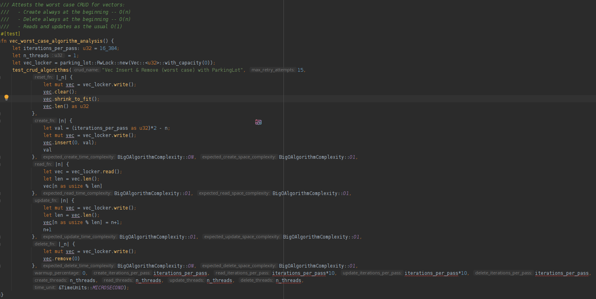
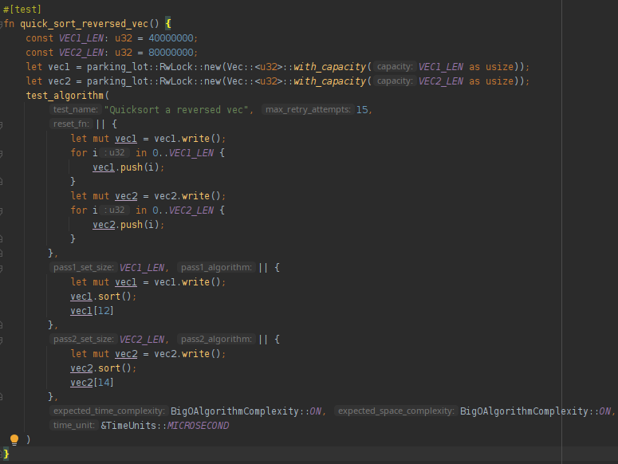

# the *big-O-test* crate

[gh-image]: https://github.com/zertyz/big-o/workflows/Rust/badge.svg
[gh-checks]: https://github.com/zertyz/big-o/actions/workflows/rust.yml
[cratesio-image]: https://img.shields.io/crates/v/big-o-test.svg
[cratesio]: https://crates.io/crates/big-o-test
[docsrs-image]: https://docs.rs/big-o-test/badge.svg
[docsrs]: https://docs.rs/big-o-test

[![big-o-test GitHub Actions][gh-image]][gh-checks]
[![big-o-test on crates.io][cratesio-image]][cratesio]
[![big-o-test on docs.rs][docsrs-image]][docsrs]


The `big-O-test` crate dynamically analyzes algorithms for *space* and *time* resource consumption, allowing tests to enforce a maximum
complexity -- detecting, as soon as possible, eventual performance regressions.

Browse the [Docs][docsrs].


It is able to operate both on regular and iterator algorithms -- the later being useful to test CRUD operations.

Reports are issued using the *Big O Notation* (hence the name) and it works by measuring how the
algorithm's CPU times & RAM space requirements grow in relation to the amount of data or number of elements that it is
applied on.

By using this crate on *tests*, you are enforcing -- through real measurements -- how your program
should behave in regard to resource consumption -- allowing you to foresee, when in production, the resource requirements
and, eventually, helping in the process of optimization, as you are free to do changes that are sure to cause a test failure
when regressions in space or time complexities are introduced.
It is, as such, meant to work as a *development tool*, alongside with *tests* & *benchmarks*.

A distinction is made between regular, non-iterator Algorithms and Iterator Algorithms.
The latter encompasses algorithms that operate on a single element per call;
they may fit into the following categories:
  * those that alter the amount of data they operate on -- such as inserts, deletes, extractions and loads (EtL)
  * those that operate on a constant data set -- such as queries and data transformations (eTl)

A special method is provided to test CRUD operations, as in the example bellow:


## CRUD test example



The optional measurement output issued by this test:
````no_compile
Vec Insert & Remove (worst case) with ParkingLot CRUD Algorithm Complexity Analysis:
  First Pass (create: 8090µs/+64.42KiB, read: 15254µs/+432.00b, update: 13948µs/+432.00b); Second Pass (create: 22440µs/+64.42KiB, read: 15232µs/+432.00b, update: 13839µs/+432.00b):

'Create' set resizing algorithm measurements:
pass          Δt              Δs            Σn            t⁻
1)        8090µs       +64.42KiB         16384         0.494µs
2)       22440µs       +64.42KiB         32768         1.370µs
--> Algorithm  Time Analysis: O(n)
--> Algorithm Space Analysis: O(1) (allocated: 128.20KiB; auxiliary used space: 656.00b)


'Read' constant set algorithm measurements:
pass          Δt              Δs            Σn            ⊆r            t⁻
1)       15254µs        +432.00b         16384        163840         0.093µs
2)       15232µs        +432.00b         32768        163840         0.093µs
--> Algorithm  Time Analysis: O(1)
--> Algorithm Space Analysis: O(1) (allocated: 208.00b; auxiliary used space: 656.00b)


'Update' constant set algorithm measurements:
pass          Δt              Δs            Σn            ⊆r            t⁻
1)       13948µs        +432.00b         16384        163840         0.085µs
2)       13839µs        +432.00b         32768        163840         0.084µs
--> Algorithm  Time Analysis: O(1)
--> Algorithm Space Analysis: O(1) (allocated: 208.00b; auxiliary used space: 656.00b)


Delete Passes (2nd: 23365µs/+432.00b; 1st: 7744µs/+432.00b) r=262144:
'Delete' set resizing algorithm measurements:
pass          Δt              Δs            Σn            t⁻
1)        7744µs        +432.00b         16384         0.473µs
2)       23365µs        +432.00b         32768         1.426µs
--> Algorithm  Time Analysis: O(n)
--> Algorithm Space Analysis: O(1) (allocated: 208.00b; auxiliary used space: 656.00b)
````


## Regular algorithm example

A regular, non-iterator algorithm is run only once for each pass -- in the example bellow, this algorithm is `vec::sort()`:



The optional measurement output issued by this test:
````no_compile
Running 'Quicksort a reversed vec' algorithm:
  Resetting: 3406857µs/+768.00MiB; Pass 1: 658484µs/76.29MiB; Pass 2: 1315255µs/152.59MiB

'Quicksort a reversed vec' regular-algorithm measurements:
pass          Δt              Δs             n            s⁻           t⁻
1)      658484µs        76.29MiB      40000000            2b         0.016µs
2)     1315255µs       152.59MiB      80000000            2b         0.016µs
--> Algorithm  Time Analysis: O(n)
--> Algorithm Space Analysis: O(n) (allocated: 0.00b; auxiliary used space: 228.88MiB)
````


## Usage in projects

Add this to your `Cargo.toml`:
````no_compile
[dev-dependencies]
ctor = "0.1"
big-o-test = "0.2"
````

Then create an Integration Test, setting it up to execute tests linearly -- see `tests/big_o_tests.rs` for an example
on how this may be easily achieved.

Disabling the Rust's default Parallel Test Runner is crucial for accurately measuring time & memory -- nonetheless,
special care was taken to avoid flaky tests: an automatic retrying mechanism kicks in when the time complexity analysis
doesn't match the maximum accepted value.


## Note

To measure the space resource requirements, this crate sets a custom Global Allocator capable of gathering allocation
metrics. It only affects tests, but still imposes a non-negligible overhead -- each allocation / de-allocation updates
a dozen atomic counters.