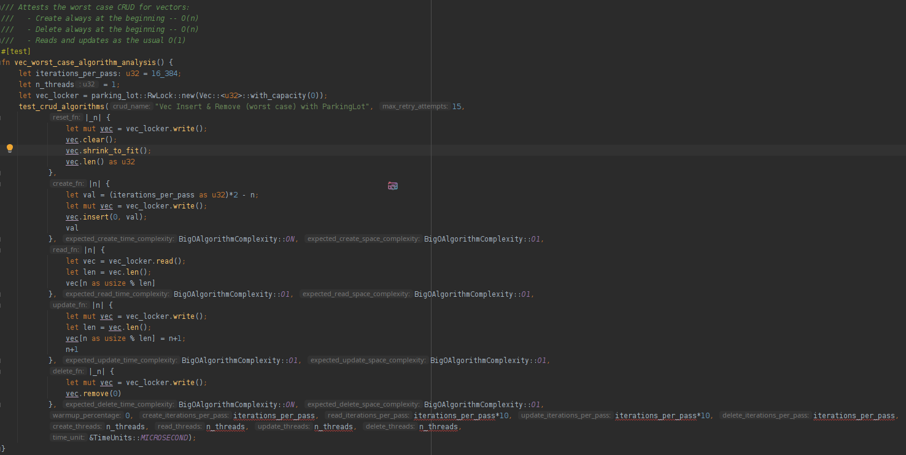

# the *big-O* crate

The `big-O` crate dynamically analyzes algorithms for *space* and *time* resource consumption, allowing tests to enforce a minimum
complexity -- detecting, as soon as possible, eventual performance regressions.

Reports are issued using the `Big O Notation` (hence the name) and it works by measuring how the
algorithm's CPU times & RAM space requirements grow in relation to the amount of data that is applied to it.

By using this crate on `tests`, you are enforcing -- through real measurements -- how your program
should behave in regard to resource consumption -- allowing you to foresee the current resource requirements/limits and,
eventually, helping in the process of optimization -- as you are free to do changes that are sure to cause a test failure,
denying regressions in space or time complexities.
It is, as such, meant to work as a *development tool*, alongside with *tests* & *benchmarks*.

Algorithms under analysis may fit into the following categories:
  * those that alter the amount of data they operate on -- such as inserts, deletes, extractions and loads (EtL)
  * those that operate on a constant set -- such as queries and data transformations (eTl)

A special method is provided to test CRUD operations, as in the example bellow:


## CRUD test example




## Measurement output (optional)

````
Vec Insert & Remove (worst case) with ParkingLot CRUD Algorithm Complexity Analysis:
  First Pass (create: 8090µs/+64.42KiB, read: 15254µs/+432.00b, update: 13948µs/+432.00b); Second Pass (create: 22440µs/+64.42KiB, read: 15232µs/+432.00b, update: 13839µs/+432.00b):

'Create' set resizing algorithm measurements:
pass          Δt              Δs            Σn            t⁻
1)        8090µs       +64.42KiB         16384         0.494µs
2)       22440µs       +64.42KiB         32768         1.370µs
--> Algorithm  Time Analysis: O(n)
--> Algorithm Space Analysis: O(1) (allocated: 128.20KiB; auxiliary used space: 656.00b)


'Read' constant set algorithm measurements:
pass          Δt              Δs            Σn            ⊆r            t⁻
1)       15254µs        +432.00b         16384        163840         0.093µs
2)       15232µs        +432.00b         32768        163840         0.093µs
--> Algorithm  Time Analysis: O(1)
--> Algorithm Space Analysis: O(1) (allocated: 208.00b; auxiliary used space: 656.00b)


'Update' constant set algorithm measurements:
pass          Δt              Δs            Σn            ⊆r            t⁻
1)       13948µs        +432.00b         16384        163840         0.085µs
2)       13839µs        +432.00b         32768        163840         0.084µs
--> Algorithm  Time Analysis: O(1)
--> Algorithm Space Analysis: O(1) (allocated: 208.00b; auxiliary used space: 656.00b)


Delete Passes (2nd: 23365µs/+432.00b; 1st: 7744µs/+432.00b) r=262144:
'Delete' set resizing algorithm measurements:
pass          Δt              Δs            Σn            t⁻
1)        7744µs        +432.00b         16384         0.473µs
2)       23365µs        +432.00b         32768         1.426µs
--> Algorithm  Time Analysis: O(n)
--> Algorithm Space Analysis: O(1) (allocated: 208.00b; auxiliary used space: 656.00b)
````


## Usage in projects

Add this to your `Cargo.toml`:
````
[dev-dependencies]
ctor = "0.1"
big-o = "0.2"
````

Then create an Integration Test, setting it up to execute tests linearly -- see `tests/std_containers.rs` for an example
on how this may be easily achieved.

Disabling the Rust's default Parallel Test Runner is crucial for accurately measuring time & memory.


## Note

To measure the space resource requirements, this crate sets a custom Global Allocator capable of gathering allocation
metrics. It only affects tests, but still imposes a non-negligible overhead -- each allocation / de-allocation updates
a dozen atomic counters.